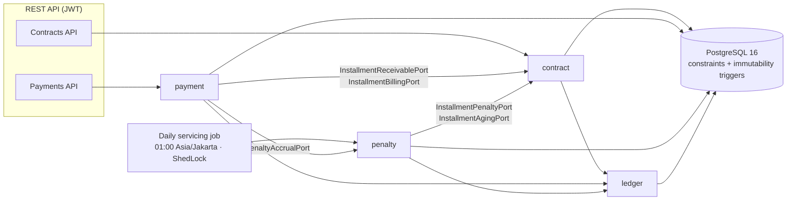

# Serfira — Multifinance Loan Servicing Core

[](https://github.com/HansImmanuel/serfira/actions/workflows/ci.yml)

Serfira is the **servicing core of a loan management system** for a multifinance company
(vehicle and consumer-goods financing, Indonesian market). It covers everything that happens
after a loan is approved: installment schedules, payments, allocation, late penalties, aging,
and a double-entry ledger that records every money movement.

It is a portfolio project built around one idea: **money must always balance**. Financial rules
are enforced twice, in pure Java engines and again as PostgreSQL constraints, so a bug in one
layer cannot silently corrupt the books.

**Stack:** Java 21 · Spring Boot 4 · PostgreSQL 16 · Flyway · Testcontainers · ShedLock · Docker

---

## Highlights

- **Double-entry ledger.** Every financial event (disbursement, interest billing, penalty
  accrual, payment) posts a balanced journal entry. Journal rows are immutable; corrections are
  reversal entries, never updates. → [ADR-002](docs/adr/ADR-002-double-entry-ledger.md),
  [ADR-008](docs/adr/ADR-008-ledger-posting-semantics.md)
- **Invariants enforced in the database.** Deferred constraint triggers reject unbalanced
  journals, allocations that don't sum to the payment, and installment over-payment.
  `BEFORE UPDATE OR DELETE` triggers make posted records append-only.
- **Idempotent writes.** `POST /contracts` and `POST /payments` require an `Idempotency-Key`.
  A retry replays the original response; the same key with a different payload returns `409`.
  → [ADR-007](docs/adr/ADR-007-idempotent-contract-creation.md)
- **Concurrency under contention.** The daily job and live payments can touch the same
  installments. Optimistic locking plus bounded retry (3 attempts, 50 and 150 ms pauses) handles
  lock conflicts and unique-violation races; an integration test forces a real race against
  PostgreSQL.
- **Correct even when the batch job is late.** Payments bill due interest and accrue penalties
  lazily in the same transaction, so a payment is allocated correctly whether or not the nightly
  job has run. → [ADR-011](docs/adr/ADR-011-billing-recognition-and-maturity-close.md),
  [ADR-014](docs/adr/ADR-014-lazy-penalty-accrual-in-payment-path.md)
- **Deterministic time.** An injectable clock and a fixed business zone (`Asia/Jakarta`) make
  date-sensitive logic (due dates, grace periods, month-end clamping, leap years) fully testable.
  → [ADR-003](docs/adr/ADR-003-injectable-clock.md)
- **PII protected at rest.** National ID (NIK) and phone numbers are AES-256-GCM encrypted;
  uniqueness and search use HMAC lookup columns. → [ADR-004](docs/adr/ADR-004-at-rest-pii-protection.md)
- **Decisions on record.** 15 [Architecture Decision Records](docs/adr/) with alternatives
  considered and rejected.

## Domain in 60 seconds

| Term             | Meaning                                                                                                                                             |
| ---------------- | --------------------------------------------------------------------------------------------------------------------------------------------------- |
| Contract         | A financing agreement for one asset and one customer: principal, down payment, tenor, rate                                                          |
| Schedule         | Monthly installments generated at activation. **FLAT** (interest on original principal) or **EFFECTIVE** (annuity, interest on outstanding balance) |
| Allocation       | How a payment is split: **penalty → interest → principal**, oldest due installment first. Overpayment is held as customer credit                    |
| Penalty          | Daily late fee on overdue amounts, after a grace period                                                                                             |
| Aging            | Delinquency buckets: Current, 1–30, 31–60, 61–90, >90 days                                                                                          |
| Early settlement | Paying off the full outstanding early, with a rebate on interest and an admin fee                                                                   |

Example posting rules:

| Event                              | Debit                | Credit                                                     |
| ---------------------------------- | -------------------- | ---------------------------------------------------------- |
| Contract activation (disbursement) | Principal receivable | Cash                                                       |
| Interest billed on due date        | Interest receivable  | Interest income                                            |
| Daily penalty accrual              | Penalty receivable   | Penalty income                                             |
| Payment received                   | Cash                 | Penalty / interest / principal receivable, customer credit |

Full rules: [Tech Spec §3](docs/02_TECH_SPEC.md).

## Architecture

A **modular monolith**: one Spring Boot deployable, one PostgreSQL database, with bounded
contexts separated by package and communicating only through application-layer ports.
No module reads another module's tables. → [ADR-001](docs/adr/ADR-001-modular-monolith.md)



| Module       | Responsibility                                                        | Status  |
| ------------ | --------------------------------------------------------------------- | ------- |
| `contract`   | Contracts, customers, assets, activation, schedule engine             | Built   |
| `payment`    | Payments, allocation engine, retry on contention                      | Built   |
| `penalty`    | Penalty accrual, daily job (billing → penalty → aging)                | Built   |
| `ledger`     | Double-entry journal, chart of accounts, posting                      | Built   |
| `settlement` | Early settlement quote and execution                                  | Planned |
| `reporting`  | Read-only reports (aging, statements)                                 | Planned |
| `shared`     | Clock, audit, error envelope, idempotency, document numbers, security | Built   |

Every module follows `com.serfira.<module>.{api, application, domain, infrastructure}`.
Dependencies point one way: `ledger` depends on nothing, and `contract` does not know about
`payment` or `penalty`.

## Getting started

Prerequisites: JDK 21 and Docker.

```bash
# Run PostgreSQL and the app
docker compose up --build
```

- API: http://localhost:8080
- OpenAPI UI: http://localhost:8080/swagger-ui.html
- Health: http://localhost:8080/actuator/health

Flyway applies all migrations on a clean database. `docker-compose.yml` ships
**local-development-only** defaults for the database password, PII keys, and JWT secret; override
them through environment variables or a `.env` file. PostgreSQL is published on `127.0.0.1` only.

### Running tests

```bash
cd backend
./gradlew test        # Windows: gradlew.bat test
```

One command runs both unit tests and `*IT` integration tests (Testcontainers starts a real
PostgreSQL 16, so Docker must be running). CI runs the same task on every push and pull request.

### Calling the API

Every endpoint except health and OpenAPI requires a bearer JWT (HS256). The login endpoint is not
built yet (planned for Sprint 6b), so for now tokens must be signed with the configured dev secret.
The token must carry a canonical UUID `sub` (the id of an existing `app_user`, recorded as `created_by`
on writes), an `exp`, and a `roles` string array (for example `["ADMIN_OPERASIONAL"]`). A non-UUID or
`SYSTEM` subject, or a missing `exp`, is rejected with 401; a token without an allowed role is 403. A
`sub` that is not an existing `app_user` is rejected by the `created_by` foreign key at write time.

| Method | Endpoint                              | Purpose                                                            |
| ------ | ------------------------------------- | ------------------------------------------------------------------ |
| `POST` | `/api/v1/contracts`                   | Create a DRAFT contract (`Idempotency-Key` required)               |
| `POST` | `/api/v1/contracts/{id}/activate`     | Activate and generate the schedule (idempotent)                    |
| `GET`  | `/api/v1/contracts`                   | List contracts (paged, filter by status, search)                   |
| `GET`  | `/api/v1/contracts/{id}`              | Contract detail with outstanding balance                           |
| `GET`  | `/api/v1/contracts/{id}/installments` | Installment schedule                                               |
| `POST` | `/api/v1/payments`                    | Receive, allocate, and post a payment (`Idempotency-Key` required) |

## Security

- **Default-deny with a role matrix.** Only health, info, and OpenAPI paths are public. Every endpoint
  enforces the role matrix from one matcher table ending in `denyAll`; roles come from the JWT `roles`
  claim. → [ADR-005](docs/adr/ADR-005-resource-server-before-auth-stories.md),
  [ADR-015](docs/adr/ADR-015-jwt-roles-claim-and-endpoint-authorization.md)
- **Attributable writes.** A UUID JWT subject is bound to the audit context and recorded as
  `created_by`/`updated_by`. A token whose subject is not a UUID, or that carries no `exp`, is rejected
  with 401 (ADR-015). Scheduled jobs run as a seeded `SYSTEM` principal that can never log in
  (inactive, unusable password hash, enforced by a check constraint).
- **Fail-fast secrets.** The app refuses to start without its PII encryption key, HMAC key, and
  JWT secret:

  ```
  SERFIRA_SECURITY_PII_ENCRYPTION_KEY=<base64 32-byte key>
  SERFIRA_SECURITY_PII_HMAC_KEY=<base64 >=32-byte key>
  SERFIRA_SECURITY_JWT_SECRET_BASE64=<base64 >=32-byte key>
  ```

- **No plaintext PII in SQL, logs, or URLs.** API responses return customer data masked.

## Status and roadmap

| Phase        | Scope                                                                                                         | Status                                                   |
| ------------ | ------------------------------------------------------------------------------------------------------------- | -------------------------------------------------------- |
| 1 — MVP      | Contracts, FLAT/EFFECTIVE schedules, payments and allocation, ledger, penalty and aging job                   | In progress: RBAC, aging report, and statement remaining |
| 2            | Early settlement, customer credit, payment void/reversal, penalty waiver, consistency check, write-off, login | Planned                                                  |
| 3            | Next.js dashboard, reporting, outbox event publisher, export                                                  | Planned                                                  |
| 4 (optional) | Restructuring, payment gateway stub, maker-checker, microservice split demo                                   | Optional                                                 |

Out of scope by design: loan origination (credit scoring, credit bureau checks, e-KYC), funding and
treasury, field collection, real payment gateway integration, and multi-currency.

The sprint-by-sprint log is in [docs/PROGRESS.md](docs/PROGRESS.md).

## Documentation

The specifications are the source of truth and are written in Bahasa Indonesia.

| Document                                                       | Contents                                                     |
| -------------------------------------------------------------- | ------------------------------------------------------------ |
| [PRD](docs/01_PRD.md)                                          | Business rules, requirements, acceptance scenarios           |
| [Tech Spec](docs/02_TECH_SPEC.md)                              | Architecture, dependency rules, ledger design, posting rules |
| [Domain Model](docs/03_DOMAIN_MODEL.md)                        | Entities, states, invariants                                 |
| [Gaps Addendum](docs/04_GAPS_ADDENDUM.md)                      | Resolved gaps: auth, audit, configuration                    |
| [Sprint Plan](docs/05_SPRINT_PLAN.md) · [Tasks](docs/tasks.md) | Delivery plan and backlog                                    |
| [Frontend Spec](docs/06_FRONTEND_SPEC.md)                      | Planned dashboard                                            |
| [ADRs](docs/adr/)                                              | Architecture decisions                                       |

## Repository layout

```
backend/    Spring Boot application (modules above), Flyway migrations, tests
docs/       Specifications, ADRs, progress log
frontend/   (planned) Next.js dashboard
```
